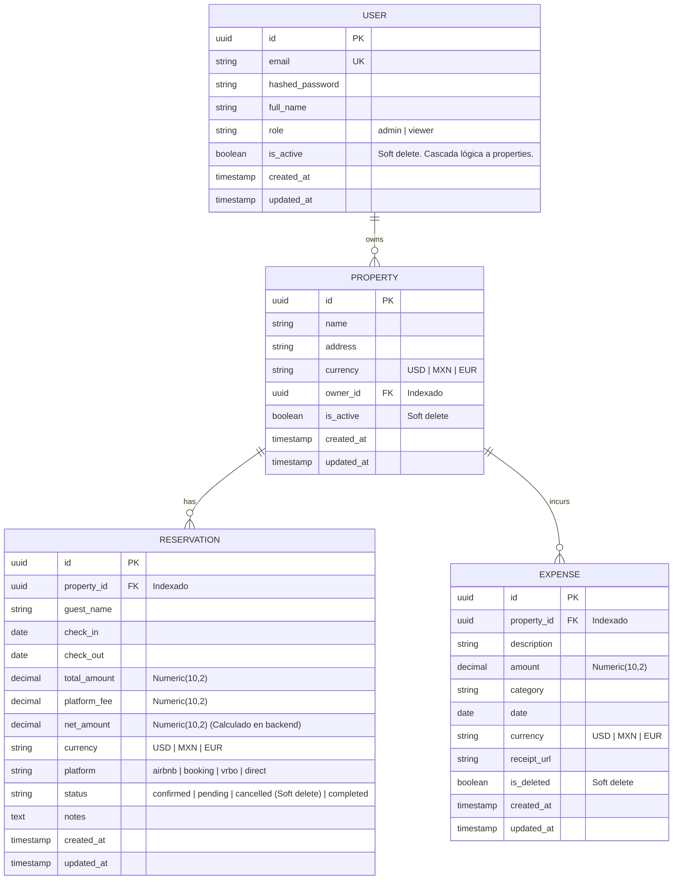

# AIFM — Luxe Ledger: Plan de Implementación Completo (V5 Final)

> Sistema de finanzas e inteligencia operativa para propiedades en Airbnb.

## Estado Actual

El proyecto tiene una base sólida de **scaffolding**:
- ✅ Monorepo Turborepo + pnpm configurado
- ✅ Docker Compose con PostgreSQL 16, Redis 7, pgAdmin 4
- ✅ Frontend: Dashboard con layout, sidebar, header y tarjetas KPI (datos estáticos)
- ✅ Backend: FastAPI inicializado con health check y config
- ✅ Tipos de dominio compartidos en `@aifm/shared`
- ❌ Sin modelos de base de datos ni migraciones
- ❌ Sin endpoints CRUD
- ❌ Sin conexión frontend ↔ backend
- ❌ Sin autenticación
- ❌ Sin motor financiero / IA
- ❌ Sin páginas secundarias (solo existe `/`)

---

## Decisiones de Arquitectura Tomadas

> [!IMPORTANT]
> **ORM y Base de Datos**: Se elimina **Prisma**. Todo el modelo de datos, migraciones (Alembic) y queries se manejarán exclusivamente con **SQLAlchemy + asyncpg**. **Habrá índices explícitos** en las llaves foráneas (`owner_id`, `property_id`) para asegurar el rendimiento en queries de multi-tenancy.
>
> **Multi-Tenancy Obligatorio**: Todas las propiedades tendrán un `owner_id` (Usuario). Todas las consultas API validarán que el usuario en sesión sea el dueño de la propiedad.
>
> **Auth, JWT, CSRF y CORS**: Se implementará **PyJWT** con cookies `httpOnly`. Las cookies tendrán `SameSite=Lax` o `Strict` para mitigar CSRF. Existirá un token de acceso (expira ej. 15 min) y un token de refresh (expira ej. 7 días) manejado en otra cookie `httpOnly`. 
> *Invalidación Segura:* Al hacer logout, el refresh token actual se registrará en una **blacklist temporal en Redis** (con TTL de 7 días).
> Se usará **Redis para Rate Limiting** en `/auth/login` contra fuerza bruta, inicializado explícitamente en el `lifespan` de `main.py`. Se ajustará `CORSMiddleware` con `allow_credentials=True` y orígenes estrictos (no `*`).
>
> **Precisión Financiera y Cálculo de Backend**: Todos los montos usarán `Numeric(10,2)` en la base de datos para prevenir bugs de redondeo. La moneda también estará presente en propiedades, gastos y **reservaciones**. El campo `net_amount` se calculará **siempre** del lado del servidor (`net_amount = total_amount - platform_fee`), ignorando cualquier valor provisto por el cliente.
>
> **Soft Deletes y Cascada**: Se usarán borrados lógicos documentados: `User` y `Property` usan `is_active`, `Expense` usa `is_deleted`, y `Reservation` usa `status="cancelled"`. *Regla de cascada lógica*: Si un `User` pasa a `is_active=False`, sus propiedades se consideran inactivas a nivel aplicación, inhabilitando accesos y operaciones.
>
> **Archivos (Receipts)**: Para el MVP, `receipt_url` apuntará a un volumen local (`/uploads` servido estáticamente por FastAPI). El endpoint de subida implementará **validación estricta de MIME types** (sólo imágenes y PDF) y **límite de tamaño de archivo (ej. 5MB)** para evitar abusos. Se añadirá un volumen persistente de Docker en `docker-compose.yml`. La interfaz estará diseñada para cambiar fácilmente a AWS S3 en el futuro.

---

## Modelo de Datos (ER Diagram)

> **Nota sobre `occupancy_rate`:** Se calculará dinámicamente infiriendo los días ocupados por reservaciones confirmadas o completadas en un mes específico, dividido por el total de días del mes.

---

## Fases de Implementación

---

### Fase 1 — Base de Datos, Conexión y Tests Base

> Objetivo: Establecer la capa de persistencia con SQLAlchemy async + Alembic, garantizando precisión financiera y multi-tenancy.

#### Backend Core
- **`database.py`**: `AsyncEngine`, `AsyncSessionLocal`, `Base`. Modificar `config.py` para BD.

#### Modelos SQLAlchemy (`apps/server/app/models/`)
- Inclusión estricta de `Numeric(10,2)` y campo `currency` generalizado.
- **Alembic**: Migraciones con creación explícita de índices (`index=True` en `owner_id` y `property_id`).
- Script **`seed.py`** con datos de prueba realistas vinculados a un usuario `admin@aifm.dev`.

#### Pruebas Unitarias
- Setup de base de test y validación de retención de precisión `Numeric(10,2)`.

---

### Fase 2 — Backend API (Endpoints CRUD, Storage y Auth Avanzado)

> Objetivo: API REST funcional, robusta, protegida contra abusos y con almacenamiento de archivos.

#### Auth, Seguridad y Rate Limiting (`apps/server/app/core/`)
- Hashing con `passlib`, generación de Access/Refresh JWT con **`PyJWT`**.
- Endpoints de login/logout/refresh configurando cookies con `SameSite=Strict` o `Lax`, y `Secure` en producción.
- **Blacklist en Redis** para la invalidación de refresh tokens post-logout.
- Inicialización de **`fastapi-limiter` con Redis** en el bloque `lifespan` del `main.py` para proteger el endpoint `/auth/login`. Configuración estricta de `CORSMiddleware` con `allow_credentials=True`.

#### Almacenamiento Local (`apps/server/app/services/storage.py`)
- Configuración de un directorio local estático para uploads (`/uploads`), montado como volumen en `docker-compose.yml`.
- Endpoint de subida validando **tipo de archivo** (`image/png`, `image/jpeg`, `application/pdf`) y limitando a **5MB** por archivo.

#### Services y Endpoints (`apps/server/app/services/` y `routes/`)
- CRUD de entidades validando `owner_id` estricto y la regla de cascada lógica (User activo -> Properties activas). El cálculo de `net_amount` se realizará 100% en el servidor basado en `total_amount` y `platform_fee`.

#### Pruebas Unitarias
- Tests de expiración, blacklist y refresh de JWT. Tests de Rate Limiting. Tests de aislamientos multi-tenant. Validación de uploads maliciosos. Validación del cálculo de `net_amount` server-side.

---

### Fase 2.5 — Motor Financiero e Integración IA (Background Tasks)

> Objetivo: Lógica financiera determinística y agentes asíncronos apoyados por LLMs de forma controlada y resiliente.

#### Motor Determinístico (`apps/server/app/engine/`)
- **`golden_rule.py`**: Lógica de cálculo puro y **única fuente de verdad**. Si hay discrepancias con los resultados del agente IA, el motor determinista tiene siempre la última palabra. *Tests unitarios desde el Día 1.*

#### Agentes LangGraph (`apps/server/app/agents/`)
- Función de la IA: Generar alertas (ej. discrepancias entre depósitos de Airbnb y cálculos del motor), **nunca sobreescribir datos financieros**.
- LLM Provider: **OpenAI** (`OPENAI_API_KEY` en `.env`). Se limitará el uso al modelo `gpt-4o-mini`.
- **Límites Duros de Costo**: 
  - Switch global `ENABLE_AI_AGENTS=True|False` en el `.env` (desactivado en desarrollo/testing para ahorrar API calls).
  - Rate Limiting en Redis estricto para operaciones con LLMs, incluyendo **límite por usuario (ej. 50 llamadas al día)** y un **límite global de tenant/sistema** para prevenir facturaciones excesivas accidentales.
- **Ejecución Asíncrona con Polling**: 
  - Los endpoints de IA encolarán la tarea vía `BackgroundTasks` y persistirán el estado del job en Redis con un TTL (ej. 24h).
  - Retornarán un `job_id` al frontend.
  - Endpoint **`GET /api/v1/jobs/{job_id}`** que devolverá el estado actual: `pending`, `processing`, `completed` (con resultado), o `failed`.
  - *Mejora futura: Reemplazar polling con SSE o WebSockets cuando la infraestructura lo demande.*

---

### Fase 3 — Frontend: Infraestructura de Datos

> Objetivo: Conexión segura y manejo de estado.

- **API Client** (`lib/api.ts`): Configurado con `credentials: 'include'`. Lógica de intercepción de 401 para intentar refresh token automático antes de desloguear.
- Hooks y Contextos (`AuthProvider`, `PropertyContext`). Componentes Base (`DataTable`, `Modal`).

---

### Fase 4 — Frontend: Páginas Completas

> Objetivo: Vistas del dashboard y CRUDs sin buscador global duplicado.

- Páginas funcionales para Dashboard, Propiedades, Ingresos, Gastos y Reportes. Recharts para visualizaciones. Implementación de polling de job IDs para interfaces dependientes de IA.

---

### Fase 5 — Búsqueda Global y Exportación

> Objetivo: Funcionalidades transversales avanzadas.

- **Buscador Global**: Única implementación de búsqueda en `Header.tsx` consumiendo `/api/v1/search`.
- **Exportación**: CSV y PDF desde el backend.

---

### Fase 6 — Pulido y UX Premium

> Objetivo: Experiencia final.
- Animaciones Framer Motion, Responsividad, Error Boundaries.

---

## Estrategia de Paralelización (Equipo de 6 Devs)

Para maximizar la velocidad, el trabajo se dividirá con **Contratos de Datos Previos**:

**Día 0 (Kickoff y Contratos):**
- **Dev 1 (Backend Core)** y **Dev 2 (Backend AI)** definen en conjunto los **Schemas Pydantic** (inputs/outputs) que conectarán el CRUD con el Motor Financiero. Se mockean estos contratos antes de escribir lógica.

**Semana 1-2:**
- **Dev 1**: Fase 1 (Modelos, Alembic, Índices, Seed).
- **Dev 2**: Fase 2.5 (Motor Regla de Oro + LangGraph en BackgroundTasks, Job Status API, Limites IA Redis). *Desacoplado gracias al contrato previo.*
- **Dev 3**: Fase 2 (Auth JWT + Refresh, Blacklist Redis, Rate Limit, Uploads Seguros).
- **Dev 4**: Fase 3 (Infraestructura Frontend, Axios/Fetch Interceptors para Refresh Token, MSW para mockear endpoints).
- **Devs 5 & 6**: Fase 4 (UI Recharts, Tablas, Modales) consumiendo el mock de Dev 4.

**Semana 3-4:**
- Integración Backend-Frontend, Fase 5 (Search, Exports) y Fase 6 (UX final).

---

## Dependencias a Instalar / Cambiar

**Backend (`apps/server`)**:
- Agregar `PyJWT`, `redis`, `fastapi-limiter`, `aiofiles`, `python-multipart` (para form data uploads).
- Instalar `langgraph`, `langchain-openai`.
- Testing: `pytest`, `pytest-asyncio`.

**Frontend (`apps/web`)**:
- Instalar `recharts`, `framer-motion`.
- Remover remanentes de NextAuth.
