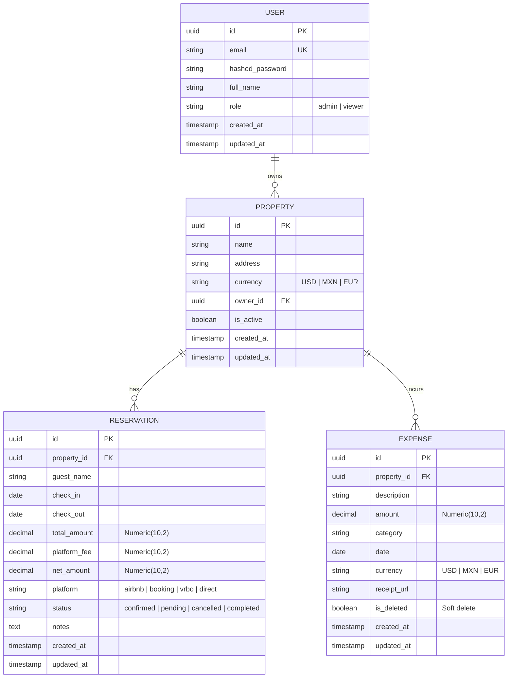

# AIFM — Luxe Ledger: Plan de Implementación Completo (Revisado)

> Sistema de finanzas e inteligencia operativa para propiedades en Airbnb.

## Estado Actual

El proyecto tiene una base sólida de **scaffolding**:
- ✅ Monorepo Turborepo + pnpm configurado
- ✅ Docker Compose con PostgreSQL 16, Redis 7, pgAdmin 4
- ✅ Frontend: Dashboard con layout, sidebar, header y tarjetas KPI (datos estáticos)
- ✅ Backend: FastAPI inicializado con health check y config
- ✅ Tipos de dominio compartidos en `@aifm/shared`
- ❌ Sin modelos de base de datos ni migraciones
- ❌ Sin endpoints CRUD
- ❌ Sin conexión frontend ↔ backend
- ❌ Sin autenticación
- ❌ Sin motor financiero / IA
- ❌ Sin páginas secundarias (solo existe `/`)

---

## Decisiones de Arquitectura Tomadas

> [!IMPORTANT]
> **ORM y Base de Datos**: Se elimina **Prisma** (carpeta `packages/database`). Todo el modelo de datos, migraciones (Alembic) y queries se manejarán exclusivamente con **SQLAlchemy + asyncpg** en el backend.
>
> **Autenticación**: Se descarta NextAuth.js. Se implementará **JWT con cookies `httpOnly`** gestionadas directamente desde FastAPI, ya que no se requiere login social externo y reduce la complejidad arquitectónica.
>
> **Multi-Tenancy**: El sistema nace **Multi-Tenant** desde el Día 1. Todas las propiedades tendrán un `owner_id` (Usuario). Todas las consultas API validarán que el usuario en sesión sea el dueño de la propiedad solicitada.
>
> **Decimales**: Todos los montos financieros usarán `Numeric(10,2)` en la base de datos para prevenir bugs de redondeo.
>
> **Soft Deletes**: Todas las entidades principales (`Property`, `Reservation`, `Expense`) usarán borrado lógico (ej. `status = "cancelled"` o `is_deleted = True`) para mantener la integridad histórica y financiera.

---

## Modelo de Datos (ER Diagram)

> **Nota sobre `occupancy_rate`:** Se calculará dinámicamente infiriendo los días ocupados por reservaciones confirmadas o completadas en un mes específico, dividido por el total de días del mes. En el futuro, si se requiere mayor precisión, se agregará un modelo de `CalendarBlock`.

---

## Fases de Implementación

---

### Fase 1 — Base de Datos, Conexión y Tests Base

> Objetivo: Establecer la capa de persistencia con SQLAlchemy async + Alembic, garantizando precisión financiera y multi-tenancy.

#### Backend Core
- **`database.py`**: `AsyncEngine`, `AsyncSessionLocal`, `Base`.
- Modificar `config.py` para añadir settings de BD.

#### Modelos SQLAlchemy (`apps/server/app/models/`)
- **`user.py`**, **`property.py`**, **`reservation.py`**, **`expense.py`**.
- Configuración de relaciones.
- Inclusión estricta de `Numeric(10,2)` para todos los campos financieros.
- Implementación de soft-deletes (`is_active` / `is_deleted` / `status`).

#### Migraciones y Seed
- Setup de **Alembic** (`alembic.ini`, `env.py` async).
- Generación de la migración inicial.
- Script **`seed.py`** con datos de prueba realistas vinculados a un usuario `admin@aifm.dev`.

#### Pruebas Unitarias
- **`tests/conftest.py`**: Setup de base de datos de test en memoria o transaccional.
- **`tests/models/test_financial_precision.py`**: Validar inserción y recuperación de `Numeric(10,2)` sin pérdida de datos.

---

### Fase 2 — Backend API (Endpoints CRUD y Auth)

> Objetivo: API REST funcional protegida por Auth y Multi-Tenancy.

#### Auth y Seguridad (`apps/server/app/core/`)
- **`security.py`**: Hashing con `passlib`, generación de JWT con **`PyJWT`**.
- Dependency `get_current_user()` que lee el JWT de una cookie `httpOnly` o header `Authorization`.
- Endpoints de login/logout fijando/limpiando la cookie.

#### Schemas Pydantic (`apps/server/app/schemas/`)
- Creación de schemas para creación, actualización y respuestas de todas las entidades.

#### Services (Lógica de negocio) (`apps/server/app/services/`)
- CRUD de propiedades, reservaciones y gastos **validando siempre el `owner_id`**.
- **Dashboard Service**: Lógica de cálculo de `net_profit` (Ingresos netos - Gastos) y cálculo de `occupancy_rate`.

#### Endpoints API (`apps/server/app/api/v1/routes/`)
- `/auth`, `/properties`, `/reservations`, `/expenses`, `/dashboard`.

#### Pruebas Unitarias
- **`tests/api/test_auth.py`**: Test de login, generación de cookies.
- **`tests/api/test_multi_tenancy.py`**: Asegurar que el Usuario A no puede ver/editar propiedades del Usuario B.
- **`tests/api/test_crud_endpoints.py`**: Pruebas de integración por entidad.

---

### Fase 2.5 — Motor Financiero "Regla de Oro" e Integración IA (LangGraph)

> Objetivo: Separar la lógica financiera compleja y los agentes de conciliación del CRUD estándar.

#### Motor Determinístico (`apps/server/app/engine/`)
- **`golden_rule.py`**: Motor financiero puro. Recibe inputs (reservas, gastos, fees de plataforma) y produce outputs determinísticos (P&L, conciliación esperada, cashflow). No toca la BD, es lógica pura.
- **`tests/engine/test_golden_rule.py`**: Batería intensiva de pruebas unitarias validando edge cases (ej. cancelaciones con penalidad, doble moneda). *Desde el Día 1.*

#### Agentes LangGraph (`apps/server/app/agents/`)
- **`conciliation_agent.py`**: Grafo de LangGraph que revisa discrepancias (ej. lo depositado por Airbnb vs lo calculado por el Motor).
- **`transaction_parser_agent.py`**: Agente para clasificar gastos subidos mediante texto o recibos.
- Endpoints en `api/v1/routes/engine.py` para disparar estas tareas.

---

### Fase 3 — Frontend: Infraestructura de Datos

> Objetivo: Conectar el frontend con la API del backend usando cookies `httpOnly`.

- **API Client** (`lib/api.ts`): Wrapper de `fetch` configurado con `credentials: 'include'` para enviar cookies automáticamente. Manejo global de 401 Unauthorized para redirección al Login.
- **Hooks y State**: `useProperties`, `useReservations`, etc.
- **Context**: `AuthProvider` para estado global del usuario, `PropertyContext` para la propiedad seleccionada.
- **Componentes Base**: `DataTable`, `Modal`, `StatCard`, `LoadingSkeleton`.

---

### Fase 4 — Frontend: Páginas Completas

> Objetivo: Implementar todas las vistas del dashboard y CRUDs.

- **Dashboard (`/`)**: Refactor para usar data real del backend. Gráficas con Recharts.
- **Propiedades (`/properties`)**: Grid y vista detalle.
- **Ingresos/Reservaciones (`/income`)**: Listado con filtros y formularios (CRUD).
- **Gastos (`/expenses`)**: Listado con filtros por categoría y registro de comprobantes.
- **Reportes (`/reports`)**: Vistas avanzadas de métricas.

---

### Fase 5 — Búsqueda Global y Exportación

> Objetivo: Funcionalidades transversales avanzadas.

- **Buscador Global**: En `Header.tsx`, conectado al nuevo endpoint `/api/v1/search` para buscar en todo el tenant.
- **Exportación**: Endpoints en backend para generar CSV de transacciones y P&L. Botones de descarga en el frontend.

---

### Fase 6 — Pulido y UX Premium

> Objetivo: Experiencia de usuario impecable.

- Animaciones con `framer-motion`.
- Responsive Design completo (Mobile/Tablet/Desktop).
- Error Boundaries y Toasts de éxito/error.
- SEO Básico.

---

## Estrategia de Paralelización (Equipo de 6 Devs)

Para maximizar la velocidad con 6 personas, el trabajo se dividirá desde el Día 1:

**Semana 1-2:**
- **Dev 1 (Backend Expert)**: Fase 1 (Modelos, Alembic, Multi-tenancy) y schemas base.
- **Dev 2 (Backend AI/Engine)**: Fase 2.5 (Motor Regla de Oro y setup LangGraph) + Tests del motor. Completamente aislado del CRUD.
- **Dev 3 (Full-Stack / Backend)**: Fase 2 (Auth por JWT con cookies, primeros endpoints CRUD).
- **Dev 4 (Tech Lead / Front Infra)**: Fase 3 (Contextos, API client con interceptors, hooks básicos usando MSW o data hardcodeada simulando el payload).
- **Devs 5 & 6 (Frontend UI)**: Fase 4. Construcción de páginas (Expenses, Income, Dashboard Recharts) consumiendo los hooks creados por Dev 4 con datos falsos hasta que el backend esté listo.

**Semana 3-4:**
- Todo el equipo se enfoca en integración (Frontend consumiendo API real).
- Implementación de Búsqueda y Exportación (Fase 5).
- Pulido visual (Fase 6).

---

## Dependencias a Instalar / Cambiar

**Backend (`apps/server`)**:
- Agregar `PyJWT`, remover `python-jose`.
- Instalar `langgraph`, `langchain-openai` (o el LLM a usar).
- Agregar `pytest`, `pytest-asyncio` para testing.

**Frontend (`apps/web`)**:
- Instalar `recharts`, `framer-motion`.
- (NextAuth se elimina).
